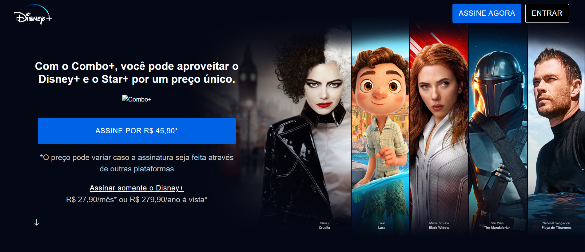
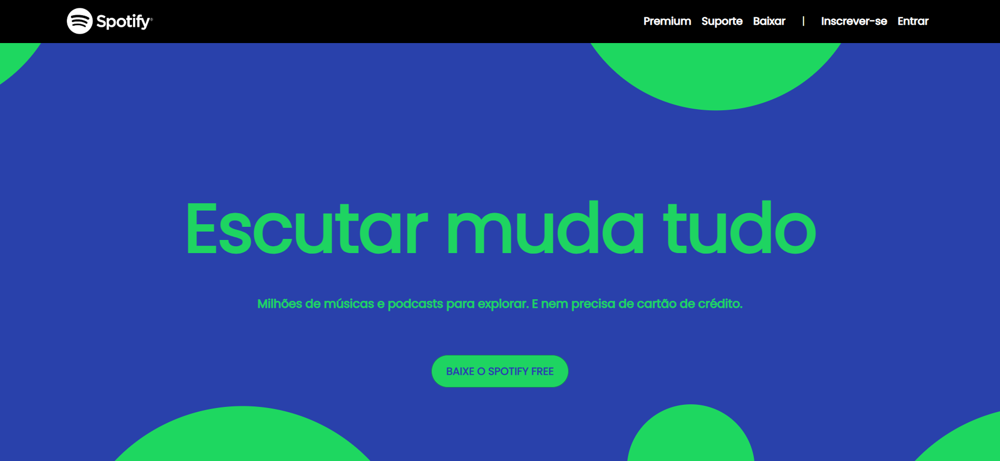

# 🎨 Clones de Sites Frontend


**Recriações precisas de sites famosos**

[](https://developer.mozilla.org/pt-BR/docs/Web/HTML)
[](https://developer.mozilla.org/pt-BR/docs/Web/CSS)
[](https://developer.mozilla.org/pt-BR/docs/Learn/CSS/CSS_layout/Responsive_Design)

[🌐 Ver Projetos](https://github.com/adrian1715/frontend-website-clones) • [📝 Reportar Bug](https://github.com/adrian1715/frontend-website-clones/issues) • [✨ Sugerir Funcionalidade](https://github.com/adrian1715/frontend-website-clones/issues)

Live Demos: [Disney Plus](https://portfolio-website-adrian-lobato.onrender.com/projects/website-clones/disney-plus) • [Spotify](https://portfolio-website-adrian-lobato.onrender.com/projects/website-clones/spotify)

---

## 📖 Sobre o Projeto

Este repositório contém **clones frontend** de plataformas de streaming populares, construídos como projetos de prática para melhorar habilidades em HTML/CSS e demonstrar proficiência em replicar interfaces de usuário complexas.

### 🎯 Clones Incluídos

#### 1. 🎬 Clone Disney+

Uma recriação fiel da landing page do Disney+ apresentando:

- Seção hero com vídeo de fundo
- Showcase de planos de assinatura
- Categorias de conteúdo
- Seção de compatibilidade de dispositivos
- Footer com links

#### 2. 🎵 Clone Spotify

Uma recriação da landing page premium do Spotify apresentando:

- Banner de assinatura premium
- Destaques de funcionalidades
- Múltiplos planos de preços
- Promoção de teste gratuito
- Navegação no footer

---

## 🌟 Características Principais

- ✅ **Design Preciso** - Recriação precisa dos layouts originais
- 🎨 **Layout Responsivo** - Funciona em todos os tamanhos de tela
- 📱 **Abordagem Mobile-First** - Otimizado para dispositivos móveis
- 🖼️ **Imagens de Alta Qualidade** - Visuais de nível profissional
- ⚡ **Carregamento Rápido** - Performance otimizada
- 🔧 **Código Limpo** - HTML/CSS bem estruturado e comentado
- 🎯 **Melhores Práticas** - HTML semântico e CSS moderno

---

## 🛠️ Construído Com

- **HTML5** - Estrutura de marcação semântica
- **CSS3** - Estilos e layouts avançados
  - Flexbox
  - CSS Grid
  - Media Queries
  - Animações
- **Design Responsivo** - Metodologia mobile-first

---

## 💻 Começando

### Pré-requisitos

- Um navegador web moderno (Chrome, Firefox, Safari, Edge)
- Nenhuma instalação adicional necessária!

### Instalação

1. **Clone o repositório**

   ```bash
   git clone https://github.com/adrian1715/frontend-website-clones.git
   cd frontend-website-clones
   ```

2. **Abra os clones**

   Navegue até a pasta do clone desejado e abra o `index.html`:

   **Clone Disney+:**

   ```bash
   cd "Disney-Plus"
   open index.html  # macOS
   # ou
   start index.html  # Windows
   ```

   **Clone Spotify:**

   ```bash
   cd Spotify
   open index.html  # macOS
   # ou
   start index.html  # Windows
   ```

3. **Ou use um servidor local** (recomendado)

   ```bash
   # Usando Python 3
   python -m http.server 8000

   # Usando Node.js http-server
   npx http-server
   ```

   Depois navegue para:

   - Disney+: `http://localhost:8000/Disney-Plus/`
   - Spotify: `http://localhost:8000/Spotify/`

---

## 📁 Estrutura do Projeto

```
frontend-website-clones/
├── Disney Plus/
│   ├── index.html           # Página principal Disney+
│   └── style.css           # Estilos Disney+
│
├── Spotify/
│   ├── index.html           # Página principal Spotify
│   └── style.css           # Estilos Spotify
│
├── images/                  # Pasta de imagens compartilhada
│   ├── disney-1.jpg
│   ├── disney-logo_1.jpg
│   ├── 2.png - 9.png       # Imagens Spotify
│   ├── facebook png.png
│   ├── twitter png.png
│   └── insta.png
│
├── README.md               # Documentação (Inglês)
└── README-ptbr.md          # Documentação (Português)
```

---

## 🎨 Detalhes dos Clones

### 🎬 Clone Disney+

**Funcionalidades Implementadas:**

- ✅ Seção hero em largura total com vídeo de fundo
- ✅ Barra de navegação com logo
- ✅ Grade de planos de assinatura
- ✅ Seções de showcase de conteúdo
- ✅ Exibição de compatibilidade de dispositivos
- ✅ Footer com links sociais
- ✅ Design responsivo para todos os dispositivos

**Destaques Técnicos:**

- CSS Grid para layout
- Flexbox para componentes
- Media queries para responsividade
- Fontes e ícones customizados



---

### 🎵 Clone Spotify

**Funcionalidades Implementadas:**

- ✅ Banner de assinatura premium
- ✅ Seção de destaques de funcionalidades
- ✅ Comparação de planos de preços
- ✅ Promoção de teste gratuito
- ✅ Footer com navegação
- ✅ Links de redes sociais
- ✅ Layout totalmente responsivo

**Destaques Técnicos:**

- Layout baseado em Flexbox
- Backgrounds com gradiente
- Efeitos de hover e transições
- Navegação otimizada para mobile



---

## 📱 Design Responsivo

Ambos os clones são totalmente responsivos e testados em:

### Breakpoints

- 📱 **Mobile:** 320px - 767px
- 📱 **Tablet:** 768px - 1024px
- 💻 **Desktop:** 1025px+

### Dispositivos Testados

- ✅ iPhone (vários modelos)
- ✅ iPad
- ✅ Telefones Android
- ✅ Navegadores desktop

---

## 🎓 O Que Aprendi

Construir estes clones me ajudou a melhorar minhas habilidades em:

### Habilidades Técnicas

- ✅ **Layouts CSS Avançados:** Grid, Flexbox, posicionamento
- ✅ **Design Responsivo:** Abordagem mobile-first, media queries
- ✅ **Melhores Práticas CSS:** Metodologia BEM, princípios DRY
- ✅ **Semântica HTML:** Uso adequado de tags semânticas
- ✅ **Compatibilidade entre Navegadores:** Testes e correção de problemas
- ✅ **Otimização de Performance:** Otimização de imagens, minificação CSS

### Habilidades de Design

- ✅ **Design Visual:** Compreensão de espaçamento, tipografia, cores
- ✅ **Princípios UI/UX:** Fluxo do usuário, navegação, acessibilidade
- ✅ **Replicação de Design:** Atenção aos detalhes, perfeição pixel
- ✅ **Consistência de Marca:** Manutenção da identidade visual

---

## 🌐 Compatibilidade de Navegadores

| Navegador | Versão | Status                  |
| --------- | ------ | ----------------------- |
| Chrome    | 90+    | ✅ Totalmente Suportado |
| Firefox   | 88+    | ✅ Totalmente Suportado |
| Safari    | 14+    | ✅ Totalmente Suportado |
| Edge      | 90+    | ✅ Totalmente Suportado |
| Opera     | 76+    | ✅ Totalmente Suportado |

---

## 🤝 Contribuindo

Contribuições são bem-vindas! Se você gostaria de melhorar estes clones:

1. Faça um Fork do projeto
2. Crie sua branch de feature (`git checkout -b feature/FuncionalidadeIncrivel`)
3. Commit suas mudanças (`git commit -m 'Adiciona alguma FuncionalidadeIncrivel'`)
4. Push para a branch (`git push origin feature/FuncionalidadeIncrivel`)
5. Abra um Pull Request

### Ideias de Contribuição

- Adicionar mais clones de serviços de streaming
- Melhorar acessibilidade
- Adicionar interatividade JavaScript
- Otimizar performance
- Corrigir bugs ou problemas

---

## 📝 Licença

Este projeto é open source e está disponível sob a [Licença MIT](LICENSE).

**Nota:** Estes clones são apenas para fins educacionais. Todas as marcas registradas, logos e nomes de marcas são propriedade de seus respectivos donos.

---

## ⚠️ Aviso Legal

Estes são **projetos educacionais** criados para praticar habilidades de desenvolvimento frontend. Eles não são afiliados, endossados ou conectados ao Disney+, Spotify ou quaisquer de suas empresas controladoras. Todas as marcas registradas e direitos autorais pertencem aos seus respectivos proprietários.

**Estes clones NÃO devem ser usados para:**

- ❌ Fins comerciais
- ❌ Distribuição como aplicações reais
- ❌ Representação falsa como produtos oficiais

**Estes clones são destinados para:**

- ✅ Aprendizado e educação
- ✅ Demonstração em portfólio
- ✅ Desenvolvimento de habilidades
- ✅ Inspiração para design

---

## 👨‍💻 Autor

**Adrian Lobato**

- GitHub: [@adrian1715](https://github.com/adrian1715)
- LinkedIn: [Adrian Lobato](https://linkedin.com/in/adrian-lobato)
- Portfólio: [portfolio-website-adrian-lobato.onrender.com](https://portfolio-website-adrian-lobato.onrender.com/)

---

## 🙏 Agradecimentos

- **Disney+** e **Spotify** pelos designs originais que inspiraram estes clones
- A comunidade de desenvolvimento frontend por recursos e tutoriais
- Bootstrap pela inspiração de design responsivo

---

## 📊 Estatísticas do Projeto


---

**Se gostou desse projeto, por favor dê uma ⭐ no repositório** 🎨

_Eu agradeço de coração o seu suporte!_

[⬆ Voltar ao Topo](#-clones-de-sites-frontend)
